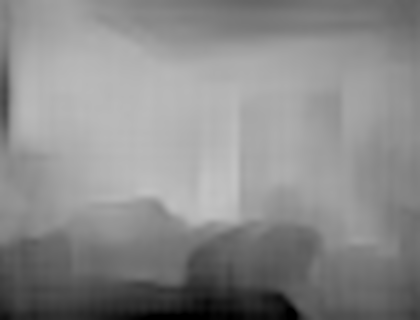

# depth-estimation-plane-detection
Course assignment for Image Analysis and Understanding 2017

A python implementation of depth estimation&plane detection described in the papers:
* [Accurate 3D ground plane estimation from a single image(ICRA 2009)](http://www-users.cs.umn.edu/~cherian/papers/3dpaperICRA09.pdf) 
* [Depth Map Prediction from a Single Image using a Multi-Scale Deep Network.(Nips 2014)](hhttp://www.cs.nyu.edu/~deigen/depth/depth_nips14.pdf)

the depth-estimation algorithm use CNN in the second paper and the plane detection algorithm  is in the first paper

## Usage

### Prerequisites
1. Python 2.7
2. Python packages : numpy, scipy, PIL(or Pillow), opencv,caffe for python, django
3. Pretrained caffe model : [model_norm_abs_100k.caffemodel](https://dl.dropboxusercontent.com/u/65091385/model_norm_abs_100k.caffemodel)

&nbsp;&nbsp;&nbsp;&nbsp;&nbsp;&nbsp;* Please download the file from link above.  
&nbsp;&nbsp;&nbsp;&nbsp;&nbsp;&nbsp;* Save the caffemodel file under `model`

### Running
```
python manage.py runserver
```

## Sample results

<p align="center">




</p>

## References

My implementation is based on the projects:

#### https://github.com/janivanecky/Depth-Estimation  
* This is a implemention of depth-estimation using CNN, I use the pretrained caffe model in that project. 

## Links

####http://itec.hust.edu.cn/~chenghn/project/Depth_Estimation/index.html
* It is our project website.

####http://lbmedia.ece.ucsb.edu/member/uweb/Teaching/website/index.htm
* Spring 2017: Image Analysis and Understanding(Our course website)


## Acknowledgements
This implementation has been tested with python2.7 and Ubuntu 16.04.
